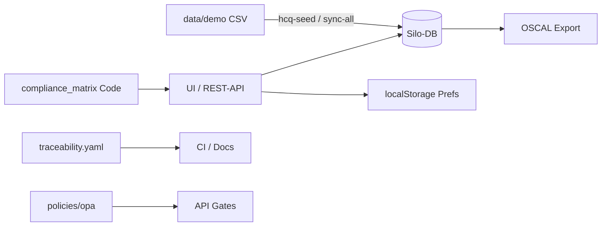

# Datenherkunft — Provenienz der HCQ-Daten

**Produkt:** Audit Ready Framework (HCQ) — Automotive Quality Intelligence  
**Stand:** 2026-08-20 · **Live-Demo:** https://hcq-demo-web.onrender.com/  
**Zweck:** Nachvollziehbar machen, **woher** Anforderungen, Twins, Compliance-Status und Nachweise stammen — ohne Overclaim.

> **Ehrlich:** In der **öffentlichen Demo** und im **Simulationsmodus** sind Fachdaten **kuratiert** (`data/demo/`, Seed). Sie sind **keine** Kundendaten und **kein** Zertifikatsnachweis. In Produktion stammen Fachobjekte aus **API-/UI-Eingabe**, Importen und (optional) echten Connectoren — Autorität für „erfüllt“ / Freigabe liegt beim Menschen mit Evidenz.

---

## 1. Übersicht der Datenquellen

| Quelle | Was kommt rein | Wo landet es | Autorität |
|--------|----------------|--------------|-----------|
| **Manuelle Eingabe (UI/API)** | Requirements, Tests, 8D, Changes, Releases, Zertifikate | Silo-DB (**SQLite** Arbeitsstandard) | **Primär** für Kundennachweise |
| **Demo-Seed / CSV-Fixtures** | DOORS-/SAP-/PLM-ähnliche Exporte | `hcq-seed --profile demo` → `hcq_simulation.db` | Nur Demo/Simulation — Banner kennzeichnet |
| **Integrations-Sync (Sim)** | Re-Import derselben CSV aus `data/demo/` | Requirements / Changes / Architecture | Fake-Gateways; in Produktion `403` |
| **BaC / BIT / Digital Twin** | Bauteiltypen, Instanzen, Twin-Schema | Repo-YAML `docs/components/` + Silo-Attestationen | Kundensilo für Laufzeit; HCQ hält keine Cloud-Twin-Daten |
| **Compliance-/Norm-Matrix** | Klausel → Nachweis → Status | Code `src/hcq/compliance_matrix/` + Live-Zeilen aus DB | Kuratiertes Mapping; `fulfilled` nur mit Nachweis |
| **Traceability (Repo)** | UUID-DAG, SWREQ-Links | `docs/traceability/traceability.yaml` + Laufzeit-Links in DB | Repo = SSOT für Produkt-Trace; Kundendaten = Silo |
| **OSCAL-Export** | Catalog / Profile / Assessment Results | Ableitung aus Matrix / Trace / Readiness (Framework-abhängig) | **Export-Abbild**, kein Zertifikat |
| **OPA Policy-Bundle** | Rego-Zugriffsregeln | `policies/opa/bundle/` | Versioniert (SHA-256 Manifest); Default oft `OPA_ENABLED=false` |
| **Browser `localStorage`** | Locale, Compliance-Domain (Automotive/Robotik), JWT | Nur Client | Keine Fachdaten-SSOT |
| **Lizenz-Token (Demo)** | Feature-Flags Framework/DT/CRA | `data/demo/*.token` | Demo-Tokens; Produktion: Vendor-JWT |
| **Exporte (ausgehend)** | OSCAL-ZIP, Reports, Attestationen | Download / USB / Silo-Ledger | Abbild des aktuellen Stands |

---

## 2. Speicherschichten

| Schicht | Inhalt | Hinweis |
|---------|--------|---------|
| **Silo-DB (SQLite)** | Fachobjekte je Umgebung: Dev `hcq_data.db`, Simulation `hcq_simulation.db` (`HCQ_DB_PATH` / `DATABASE_URL`) | Getrennt je Env — keine Vermischung Demo↔Prod ([ADR-0008](architecture/adr/ADR-0008-environment-separation-sap-integration.md)) |
| **PostgreSQL** | In Settings/DSN für Produktion vorgesehen | **Adapter noch nicht implementiert** (`NotImplementedError` in `persistence/factory.py`) — kein Live-Pfad |
| **`data/demo/`** | Kuratierte CSV + Zeichnungen + Demo-Lizenz-Tokens | Deterministisch; kein Phone-Home |
| **Repo-YAML (BaC/BIT/DT)** | `docs/components/components.yaml`, `instances.yaml`, `digital-twin-*.yaml` | Produkt-/Schema-SSOT; Kundenlaufzeit im Silo |
| **Repo-Docs / Trace** | `traceability.yaml`, SRS, Compliance-Pakete | Produktentwicklung — nicht Kundensilo |
| **`localStorage`** | `hcq-locale`, `hcq.complianceDomain`, JWT | Gerätegebunden |
| **Attestations-Ledger** | Monatsabschlüsse Digital Twin (append-only) | On-Prem Silo-SQLite (`dt_attestation_ledger`) |

---

## 3. Demo- und Simulationsdaten (Live: hcq-demo-web)

**Umgebung:** `ENVIRONMENT=simulation` · Banner: *SIMULATIONSMODUS — Demodaten, keine Produktivdaten*

| Artefakt | Pfad / Befehl | Inhalt (Beispiele) |
|----------|---------------|-------------------|
| Seed | `hcq-seed --profile demo --force` | Befüllt Simulations-DB aus CSV |
| DOORS-Export | `data/demo/doors_requirements_export.csv` | `DOORS-REQ-xxx` |
| SAP | `data/demo/sap_materials.csv`, `sap_change_masters.csv` | Materialien, Änderungen |
| PLM | `data/demo/plm_parts.csv`, `plm_bom.csv`, `drawings/*.pdf` | Teile, BOM, Zeichnungen |
| Sync-UI | `/integrations` → **Synchronisieren** | `POST /integrations/sync-all` (nur Sim/Dev) |
| Gast-Zugang | Login **Demo starten** / QM-Demo | Read-only Gast bzw. begrenztes QA-Schreiben |
| Handbuch auf Demo | `/HCQ-FUER-EINSTEIGER.pdf` (Login-Link), auch `/ANWENDUNGSHANDBUCH.pdf` | Statisch aus `frontend/public/` |

**Regel:** Fake-Gateways ersetzen **keine** echten SAP-/DOORS-/PLM-Connectoren ([ADR-0031](architecture/adr/ADR-0031-demo-simulation-framework-sap-doors-plm.md)).

Branche **Automotive / Robotik** steuert nur Norm-Matrix und Texte (`localStorage` + API `?domain=`) — **keine** Umschaltung der Seed-Herkunft.

---

## 4. Produktiv- / Kundenherkunft

| Kanal | Typische Nutzung |
|-------|------------------|
| REST-API (`/docs`) | Primärer Schreibpfad für Requirements, Tests, Trace, … |
| Berater-Import | CSV/Skripte, ALM-Mapping (Jira/Jama/…) — siehe [`user-manual/API-ANBINDUNG-KUNDE.md`](user-manual/API-ANBINDUNG-KUNDE.md) |
| UI-Schreiben | Rollenabhängig (viele Module primär lesend; Schreiben oft API-first) |
| Echte Connectoren | Roadmap — nicht als Live-Quelle der öffentlichen Demo |

**Autorität:** Status „erfüllt“, Freigaben und Sign-offs erfordern berechtigte Rollen und dokumentierte Evidenz — die Matrix setzt `fulfilled` nicht ohne Nachweis.

---

## 5. Compliance-, OSCAL- und OPA-Quellen

| Thema | Herkunft | Abgrenzung |
|-------|----------|------------|
| Norm-Matrix IATF/ISO 26262/VDA/ASPICE | Kuratiert in Code + ausgewählte Live-Zeilen | Repräsentativer Ausschnitt, kein vollständiges Normbuch |
| Robotik-Domain | Scaffold / Roadmap-Klauseln | Kein Robotik-Zertifikat |
| OSCAL `zero_trust` | u. a. `docs/security/zero-trust-compliance-matrix.md` + Trace | Nachweisstruktur |
| OSCAL `tisax_al2` / `iatf_16949` | TISAX-/IATF-Readiness-Checks (+ DB wo nötig) | Kein ENX-/IATF-Zertifikat |
| OPA | `policies/opa/bundle/policies.rego` | PDP ergänzt RBAC; Feature-Flag `OPA_ENABLED` |

CRA-Readiness leitet sich aus Twin-Validierung ab (`src/hcq/cra/`); Secure-Import-Gateway / vollständige CRA-Evidence-Kette teils **Roadmap** ([`process/cra-evidence-chain.md`](process/cra-evidence-chain.md)).

---

## 6. Was wir bewusst nicht als „Quelle“ verkaufen

- Keine Live-Anbindung an Kundensysteme in der öffentlichen Render-Demo  
- Keine automatische Zertifizierungsdatenbank oder Auditor-Bescheinigung (ASPICE/IATF/TISAX/CRA)  
- Keine Vermischung von Demo-Seed und Produktions-Silo  
- Kein stilles Überschreiben von Freigaben durch Sync oder OSCAL-Export  
- **Kein lauffähiger PostgreSQL-Adapter** trotz dokumentierter Prod-DSN — Arbeitsstandard ist SQLite  
- OSCAL/OPA ändern nicht die Provenienz-Regel: Evidence kommt aus Silo + kuratiertem Mapping, nicht aus einem Zertifikatsteller  
- Digital Twin / CRA: **Kundensilo-Selbstattestierung**; HCQ ist Werkzeughersteller, nicht Datenhalter  

---

## 7. Pflege

Bei neuen Datenpfaden:

1. Eine Zeile in §1 dieser Datei ergänzen  
2. Verweis im Anwendungshandbuch (§1.x / Anhang) und ggf. Einsteiger-Anleitung  
3. Bei Demo-CSV: `data/demo/` + ADR-0031 / Tests (`test_demo_*`, Seed)  
4. Bei Matrix/OSCAL/OPA: QT-265…267 und `test_handbook_oscal_opa.py`  

**Verwandte Docs:**  
[`user-manual/ANWENDUNGSHANDBUCH.md`](user-manual/ANWENDUNGSHANDBUCH.md) · [`demo/QUICKSTART-DEMO.md`](demo/QUICKSTART-DEMO.md) · [`architecture/adr/ADR-0031-demo-simulation-framework-sap-doors-plm.md`](architecture/adr/ADR-0031-demo-simulation-framework-sap-doors-plm.md) · [`quality/data-isolation-security-note.md`](quality/data-isolation-security-note.md) · [`compliance/oscal-export.md`](compliance/oscal-export.md) · [`process/digital-twin-on-prem.md`](process/digital-twin-on-prem.md) · [`process/cra-evidence-chain.md`](process/cra-evidence-chain.md)
