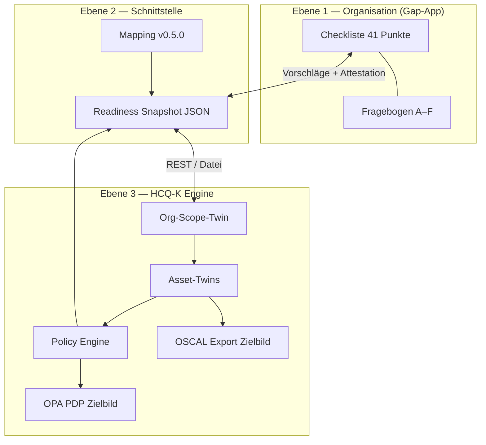

# Compliance-Handbuch — NIS2, CRA, ISO 27001 & EU AI Act

**Version:** 1.3.1 · **Stand:** 20. August 2026 · **Sprache:** Deutsch  
**Companion (EN):** [`COMPLIANCE-HANDBUCH.en.md`](./COMPLIANCE-HANDBUCH.en.md)  
**PDF:** [`COMPLIANCE-HANDBUCH.pdf`](./COMPLIANCE-HANDBUCH.pdf) (erzeugen: `tools/generate_compliance_handbuch_pdf.ps1`)  
**Zielgruppe:** Interessenten, QM, IT, CISO, Berater, Auditoren (intern)  
**Produkt:** NIS2 Gap-Analyse-App + HCQ-K Policy Engine (Digital Twin)

> **Ehrlicher Hinweis:** Dieses Handbuch beschreibt ein **Readiness- und Gap-Werkzeug**.
> Es ersetzt **keine** Rechtsberatung, **kein** externes Audit und **keine** Zertifizierung
> nach NIS2, CRA, ISO 27001 oder dem **EU AI Act**. Automatische Vorschläge sind **Hinweise mit Evidenzbezug** —
> der Status „erfüllt“ setzt immer eine **menschliche Bestätigung** mit belastbarem Nachweis voraus.

---

## Inhaltsverzeichnis

1. [Was unser Tool kann](#1-was-unser-tool-kann)
2. [Systemarchitektur in drei Ebenen](#2-systemarchitektur-in-drei-ebenen)
3. [Benutzerrollen und typische Abläufe](#3-benutzerrollen-und-typische-abläufe)
4. [Die Compliance-Module (inkl. AI Act)](#4-die-compliance-module-inkl-ai-act)
5. [Automatisierung vs. manuelle Bewertung](#5-automatisierung-vs-manuelle-bewertung)
6. [Anforderungskatalog — wie wir auf jede Regel eingehen](#6-anforderungskatalog--wie-wir-auf-jede-regel-eingehen)
7. [HCQ-K Policy-Regeln im Detail](#7-hcq-k-policy-regeln-im-detail)
8. [Vorabanalyse-Fragebogen (Teile A–G)](#8-vorabanalyse-fragebogen-teile-ag)
9. [Gap-Analyse mit HCQ-Sync](#9-gap-analyse-mit-hcq-sync)
10. [Policy-Updates und Notfall-Rollback](#10-policy-updates-und-notfall-rollback)
11. [72h-Vorfallmeldung (Premium)](#11-72h-vorfallmeldung-premium)
12. [Exports, Nachweise und Grenzen](#12-exports-nachweise-und-grenzen)
13. [§ 38 BSIG — Status Quo, Haftung & Sorgfalt](#13--38-bsig--status-quo-haftung--sorgfalt)
14. [Referenzen und Pflege](#14-referenzen-und-pflege)

**Tagesaktuell (20.08.2026):** [CHANGELOG-2026-08-20.md](./CHANGELOG-2026-08-20.md) — Brand, OSCAL/OPA, **Datenherkunft**; ältere: [CHANGELOG-2026-08-02.md](./CHANGELOG-2026-08-02.md) (EU AI Act).  
**Datenherkunft / Provenienz:** [DATENHERKUNFT.md](./DATENHERKUNFT.md)  
**EU AI Act:** [EU-AI-ACT.md](./EU-AI-ACT.md) · Gap `/gap/aiact` · Fragebogen `/fragebogen/g`  
**Betrieb (QM/IT/GF):** [BETRIEBSANLEITUNG.md](./BETRIEBSANLEITUNG.md)  
**Live-Demo:** https://nis2-kritis-web.onrender.com/

---

## 1. Was unser Tool kann

### 1.1 NIS2 Gap-Analyse-App (`app/`)

| Funktion | Beschreibung | URL / Zugang |
|----------|--------------|--------------|
| **Vorabanalyse (Fragebogen)** | Strukturierte Selbsteinschätzung für Interessenten (NIS2, ISO, CRA) ohne Lizenz | `/fragebogen` |
| **Gap-Checkliste** | 41 Anforderungspunkte A-01…E-03 mit Status, Verantwortlich, Kommentar | `/gap` (lizenziert) |
| **Visitenkarten-Navigation** | Links am Inhaltsrand: Twin · NIS2 · CRA · ISO · Notfall · Governance — Inhalt rechts | `/gap/twins` … `/gap/governance` |
| **Framework-Filter** | Sicht auf NIS2-, CRA- oder ISO-27001-relevante Punkte | Gap-Ansicht |
| **HCQ-Vorschläge** | Readiness-Snapshot importieren oder per API laden; Übernehmen/Ignorieren | Gap + HCQ-Panel |
| **Maßnahmenplan** | Offene Tickets aus HCQ-K als Maßnahmenliste | Gap-Ansicht |
| **Twin-Baum** | Asset-Inventar aus HCQ-K; **ein** Digital Twin mit Funktion / Bauteil / Lieferant | `/gap/twins` |
| **Notfall-Übungen** | BCP/DR/Krise erfassen, Protokoll-Datei Pflicht, digitale Bestätigung → Sync C-05–C-07; bestätigte Einträge unveränderlich | `/gap/continuity` |
| **JSON/PDF-Export** | Gap-Artefakt und Fragebogen-PDF für Archivierung; Governance-Blobs im JSON | Export-Buttons |
| **Management-Governance / Evidenzreport** | GF-Schulung, Leitungs-Review, Hash-Chain, optional Server-Siegel (§ 38 BSIG). **Nicht** Teil der Incident-Meldung. | `/gap/governance` |
| **Gesetzestext § 38 BSIG** | Status-Quo-Wortlaut inkl. Veröffentlichungsdatum + Abdeckungsmatrix Framework/Doku; Download als TXT | Button unter Governance |
| **Sorgfaltspaket (ZIP) v2** | Vollarchiv: JSON + Zertifikat-/Protokoll-Blobs + Melde-Freezes + Integrity + SHA-256-Manifest | Governance → ZIP |
| **Meldeautarkie / Tages-Freeze** | Zulieferer-DB, Melde-Cache, täglicher IndexedDB-Freeze (**3 Tage** Retention), Snapshot Export/Import | `/zulieferer` |
| **24h-Frühwarnung / Alertreport (Premium)** | Akutes Incident-Reporting Art. 23: Frühwarnung an Behörde; Alert an QM (CC GF); Freigabe QM/GF (Token `incident72h`). Kein Schulungszertifikat. | `/meldung-24h` |
| **72h-Vorfallmeldung (Premium)** | Akutes Incident-Reporting: Detailmeldung + CEO-Freigabe + PDF. Kein Schulungszertifikat. (1-Monats-Abschluss D-04 = QM/IT vor Ort, nicht im Tool.) | `/meldung-72h` |
| **Mehrsprachigkeit** | Deutsch / Englisch | UI-Umschalter |

**Live-Deployment (Beispiel):** https://nis2-kritis-web.onrender.com/fragebogen

### 1.2 HCQ-K Engine (`HCQ-K`)

| Funktion | Beschreibung |
|----------|--------------|
| **Digital Twin Registry** | Jedes Asset (Organisation, Hardware, Software, SBOM-Komponente) als UUID-Twin |
| **Policy Engine** | Automatische Regelauswertung gegen NIS2-, CRA- und ISO-27001-Container |
| **Quality Gate** | Ampel GREEN/YELLOW/RED pro Asset und aggregiert |
| **Readiness Snapshot** | JSON-Export mit Vorschlägen für die Gap-App (Mapping v0.5.0) |
| **Update-Schleuse** | Verifizierter Policy-Pull mit Checksum + Manifest |
| **Notfall-Rollback** | Wiederherstellung einer archivierten Policy-Revision |
| **Audit Trail** | Nachvollziehbare Events (Pull, Update, Rollback, Delta-Rescan) |
| **OSCAL Evidence (Zielbild)** | Maschinenlesbarer Export (Catalog/Profile/Assessment Results) — ADR-0046-Muster; kein Zertifikat |
| **OPA Policy Decision Point (Zielbild)** | Rego-Policies neben RBAC für kritische Pfade; Feature-Flag, fail-closed |

### 1.3 Was das Tool bewusst nicht kann

- Keine automatische „konform / nicht konform"-Zertifizierung
- Keine direkte Meldung an das BSI-Portal (kein Auto-Versand)
- Keine Penetrationstests oder technische Tiefenprüfung
- Keine Rechtsauskunft zur Betroffenheit (nur strukturierte Erfassung)
- Kein Ersatz für ISMS-Audit nach ISO 27001 oder CRA-Konformitätsbewertung
- Kein externes WORM-/Notariatsarchiv (lokale Hash-Chain ≠ gerichtsnahe Drittbeweisbarkeit)
- Keine Haftungsfreiheit — dokumentiert Sorgfalt, ersetzt keine Rechtsberatung

---

## 2. Systemarchitektur in drei Ebenen



| Ebene | Datenmodell | Fragestellung |
|-------|-------------|---------------|
| **Organisation** | Anforderungs-ID, Status, Evidenz | „Erfüllen wir die NIS2-Pflicht als Unternehmen?" |
| **Schnittstelle** | Mapping YAML, Snapshot-Schema | „Welche Twin-Signale stützen welchen Checklistenpunkt?" |
| **Asset** | Digital Twin, Tickets, Policy-Regeln | „Welche konkreten Systeme/Produkte haben Lücken?" |

### 2.1 Querschnitt OSCAL + OPA (Zielbild)

| Säule | Nutzen | Abgrenzung |
|-------|--------|------------|
| **OSCAL** (NIST 1.1) | Assessoren erhalten strukturierte Evidence statt nur PDF/Excel | **Kein** Zertifikat; Export read-only |
| **OPA** | Deklarative Policies für kritische Exports/Status/Air-Gap-Sperren | Ergänzt RBAC, **ersetzt** kein IAM |

Details: [ZIELARCHITEKTUR-IN-PROCESS-COMPLIANCE.md](./ZIELARCHITEKTUR-IN-PROCESS-COMPLIANCE.md) · [WHITEPAPER-FRAMEWORK.md](./WHITEPAPER-FRAMEWORK.md) · HCQ-K `SYSTEM-ARCHITECTURE.md`  
Referenzmuster Plattform 1: ADR-0046 (OSCAL), ADR-0047 (OPA).

### 2.2 Datenherkunft (Provenienz)

Damit Audit und Betrieb nachvollziehen können, **woher** Status, Twins und Nachweise stammen:

| Quelle | Rolle |
|--------|--------|
| Manuelle UI-Eingabe | Primäre Autorität für Gap-Status „erfüllt“ |
| HCQ-K Snapshot / API | Vorschläge + Evidenzhinweise — nie stilles Überschreiben |
| Mapping YAML v0.5.0 | Checkliste ↔ Policy-Regeln |
| Demo-Seed | Nur Demo; gekennzeichnet |
| localStorage / IndexedDB | Lokale Persistenz, Air-Gap-fähig |

Vollständige Matrix und Speicherpfade: **[DATENHERKUNFT.md](./DATENHERKUNFT.md)**

Ausführlich Schnittstelle: [SCHNITTSTELLE-NIS2-HCQ-K.md](./SCHNITTSTELLE-NIS2-HCQ-K.md)

---

## 3. Benutzerrollen und typische Abläufe

### 3.1 Interessent (ohne Lizenz)

1. Öffnet `/fragebogen`
2. Füllt Teile A (Stammdaten), B (NIS2), C (ISO), D (CRA), F (Roadmap) aus
3. Exportiert Fragebogen-PDF als Gesprächsgrundlage
4. Vereinbart Gap-Termin mit QM/IT

### 3.2 QM / Prozessverantwortlicher (mit Lizenz)

1. Öffnet `/gap`
2. Importiert HCQ Readiness-Snapshot oder synchronisiert per API
3. Prüft HCQ-Vorschläge pro Punkt → **Übernehmen** oder **Ignorieren**
4. Ergänzt manuelle Bewertung für nicht gemappte Punkte
5. Exportiert Gap-JSON/PDF und leitet Maßnahmenplan ab

### 3.3 IT / CISO (HCQ-K Betrieb)

1. Pflegt Org-Scope-Twin (`nis2_scope` auf Organisation)
2. Registriert Assets (HW, SW, SBOM) mit Owner und Version
3. Löst Policy-Verstöße (Tickets) oder kapselt mit Begründung
4. Zieht Policy-Updates über die Schleuse; bei Problemen **Rollback**

Prozessmodell: [GAP-ANALYSE-PROZESS.md](./GAP-ANALYSE-PROZESS.md)

---

## 4. Die Compliance-Module (inkl. AI Act)

| Modul | Norm / Rechtsgrundlage | Policy-Regeln (HCQ-K) | Gemappte Checklistenpunkte |
|-------|------------------------|----------------------|----------------------------|
| **NIS2** | EU 2022/2555, NIS2UmsuCG | 12 Regeln (`nis2.yaml` v0.3.0) | 17 von 51 (Kapitel A–E + Überlapp) |
| **CRA** | EU Cyber Resilience Act | 7 Regeln (`cra.yaml` v0.2.0) | überlappende Produkt-/SBOM-Punkte |
| **ISO 27001** | ISMS & Annex A (indikativ) | 11 Regeln (`iso27001.yaml` v0.3.0) | überlappende ISMS-Punkte |
| **AI Act** | VO (EU) 2024/1689 | `AIACT.*` (App-Mapping) | Kapitel **F-01…F-10** + Überlapp |

**Wichtig:** Ein Checklistenpunkt kann mehrere Module berühren (z. B. C-22 = NIS2 + CRA + ISO + AI Act).
Der Framework-Filter in der App zeigt nur die für das gewählte Modul relevanten Regeln.

**UI:** `/gap/aiact` · `/gap/aiacttext` · `/fragebogen/g` · siehe [EU-AI-ACT.md](./EU-AI-ACT.md).

---

## 5. Automatisierung vs. manuelle Bewertung

### Legende in den Tabellen unten

| Symbol | Bedeutung |
|--------|-----------|
| 🤖 **Auto** | HCQ-K erzeugt Status-Vorschlag (Snapshot); Nutzer muss bestätigen |
| 📋 **Fragebogen** | Vorabanalyse-Frage deckt Thema ab; kein Twin-Signal |
| ✍️ **Manuell** | Nur manuelle Bewertung in der Gap-Checkliste |
| ↔️ **Rückfluss** | App → HCQ (z. B. Governance-Flag auf Org-Twin) |

### Übersicht Mapping v0.5.0 (21 automatisierte Punkte)

| ID | Modul(e) | HCQ-Signal (Kurz) |
|----|----------|-------------------|
| A-01 | NIS2 | Org-Twin: `sectors`, `category` |
| A-02 | NIS2 | Org-Twin: `employee_count`, `revenue_million_eur` |
| A-03 | NIS2 | Org-Twin: `registration_status` |
| A-04 | NIS2, ISO | Org-Twin: vollständiger Scope |
| B-01 | NIS2, ISO | `governance_documented` |
| B-02 | NIS2 | `management_review_rhythm` |
| B-04 | ISO | Governance-Rollen (↔️ auch Rückfluss aus App) |
| C-01 | ISO | `risk_assessment_documented` |
| C-02 | ISO | `governance_documented` (Sicherheitskonzept) |
| C-03 | ISO | `incident_process_documented` |
| C-08 | NIS2, ISO | `responsible_user_id` auf Lieferanten-Assets |
| C-11 | NIS2, CRA | Software-Version, Produkt-Twins |
| C-12 | CRA, ISO | SBOM, Schwachstellen-Signale |
| C-13 | CRA | `vulnerability_disclosure_documented` |
| C-16 | NIS2 | HW/SW-Versionen (Cyber-Hygiene) |
| C-21 | NIS2, ISO | Asset-Ownership / IAM-Proxy |
| C-22 | NIS2, CRA, ISO | Twin-Inventar vollständig |
| C-23 | NIS2 | Owner auf privilegierten Assets (MFA-Proxy) |
| D-01 | NIS2, ISO | `incident_process_documented` |
| D-02 | NIS2, CRA | `reporting_contacts_defined` |
| E-01 | ISO | Twin-Registry als Audit-Baseline |

Quelle: [mappings/nis2-readiness-mapping.yaml](./mappings/nis2-readiness-mapping.yaml)

---

## 6. Anforderungskatalog — wie wir auf jede Regel eingehen

Referenz: [ANFORDERUNGS-KATALOG.md](./ANFORDERUNGS-KATALOG.md) (41 Punkte, synchron mit `app/src/data/requirements.ts`)

### Kapitel A — Betroffenheit & Registrierung

| ID | Anforderung | Unser Ansatz |
|----|-------------|--------------|
| **A-01** | Sektorzuordnung | 🤖 Org-Twin `sectors` + `category`; Fragebogen Teil B Block Betroffenheit; rechtliche Einordnung ✍️ |
| **A-02** | Größenschwellen | 🤖 `employee_count`, `revenue_million_eur`; Fragebogen Teil A; Schwelleninterpretation ✍️ |
| **A-03** | Behördenregistrierung | 🤖 `registration_status`; Fragebogen; konkrete Anmeldung ✍️ |
| **A-04** | Gap-Scope dokumentiert | 🤖 vollständiger `nis2_scope` (legal_entities, sectors, category); Scope-Diagramm ✍️ |

### Kapitel B — Governance (Art. 20)

| ID | Anforderung | Unser Ansatz |
|----|-------------|--------------|
| **B-01** | Billigung durch Leitung | 🤖 `governance_documented`; Fragebogen Governance; **Leitungs-Review** (`/gap/governance`) mit digitaler Bestätigung + Audit-Chain; GF-Beschluss als Evidenz ✍️ |
| **B-02** | Überwachung durch Leitung | **Leitungs-Review** periodisch bestätigen → Sync B-02; 🤖 `management_review_rhythm`; Reporting-KPIs ✍️ |
| **B-03** | Schulung Leitungsorgane | **Governance-/Evidenzreport** (`/gap/governance`): Zertifikat + SHA-256 + Hash-Chain; Gültigkeit **3 Jahre**; Warnung 90 Tage; Alarm ab 30 Tagen; bestätigte Zertifikate **unveränderlich**. Vorlage bei BSI-/Haftungsprüfung. **Nicht** in 24h-/72h-Incident-Reports. Status-Quo-Gesetzestext: Button **Gesetzestext § 38 BSIG**. |
| **B-04** | Verantwortlichkeiten | 🤖 ISO A.5.2 via `governance_documented`; ↔️ App setzt Flag zurück auf Org-Twin; RACI ✍️ |

### Kapitel C — Risikomanagement (Art. 21)

#### Logischer Pfad: Art. 21 Abs. 2 lit. a–j → Framework

Die **10 Maßnahmenkategorien** aus **Art. 21 Abs. 2 NIS2 / § 30 Abs. 2 BSIG** sind der gesetzliche Einstiegspfad in Gap-App und HCQ-K. Spine: `app/src/data/art21Categories.ts`.

| lit | Kategorie | Checklisten-IDs | HCQ-Mapping v0.5.0 |
|-----|-----------|-----------------|--------------------|
| **a** | Risikoanalyse & IT-Sicherheit | C-01, C-02 | gemappt |
| **b** | Incident Handling | C-03, C-04 | teilweise (C-03) |
| **c** | Business Continuity | C-05–C-07 | manuell |
| **d** | Lieferkettensicherheit | C-08–C-10 | teilweise (C-08) |
| **e** | Systemsicherheit (Erwerb/Entwicklung/Wartung) | C-11–C-13 | gemappt |
| **f** | Wirksamkeitsbewertung | C-14, C-15 | manuell |
| **g** | Cyberhygiene & Schulung | C-16, C-17 | teilweise (C-16) |
| **h** | Kryptografie & Verschlüsselung | C-18, C-19 | manuell |
| **i** | Zugriffskontrolle & Personalsicherheit | C-20–C-22 | teilweise (C-21, C-22) |
| **j** | Kommunikationssicherheit / MFA | C-23–C-25 | teilweise (C-23) |

**Positionierung:** Kategorien = Gesetz. Reifegradskala (Geplant → … → Kontinuierlich verbessert) = **angelehnt an BSI-RUN** — keine offizielle NIS2-Skala.

| ID | Anforderung | Unser Ansatz |
|----|-------------|--------------|
| **C-01** | Risikoanalyse | 🤖 ISO `risk_assessment_documented`; 📋 ISO-Fragebogen; Risikoregister ✍️ |
| **C-02** | Sicherheitskonzept | 🤖 Governance/Policy-Flag; 📋 Fragebogen; ISMS-Dokumente ✍️ |
| **C-03** | Incident Response | 🤖 `incident_process_documented`; 📋 Fragebogen; IR-Plan + Test ✍️ |
| **C-04** | Eskalation 24/7 | 📋 Fragebogen; Erreichbarkeitsmatrix ✍️ |
| **C-05** | Business Continuity | Visitenkarte **Notfall** (`/gap/continuity`): BCP-Übung + Protokoll-Datei (Pflicht) + Bestätigung → Sync C-05; 📋 Fragebogen; BCP-Dokument ✍️ |
| **C-06** | Disaster Recovery | Notfall-Karte: DR-/Backup-Übung + Protokoll + Bestätigung → Sync C-06; 📋 Fragebogen; Backup-Tests ✍️ |
| **C-07** | Krisenmanagement | Notfall-Karte: Krisenübung + Protokoll + Bestätigung → Sync C-07; 📋 Fragebogen; Krisenstab ✍️ |
| **C-08** | Lieferantenbewertung | 🤖 Owner auf Supplier-Assets; 📋 Fragebogen Lieferkette ✍️ |
| **C-09** | Vertragsklauseln | 📋 Fragebogen; Vertragsmuster ✍️ |
| **C-10** | Sub-Lieferanten | 📋 Fragebogen; Lieferketten-Risiko ✍️ |
| **C-11** | Sichere Entwicklung/Beschaffung | 🤖 SW-Version + CRA-Produkt-Twins; 📋 Fragebogen Secure SDLC ✍️ |
| **C-12** | Schwachstellenmanagement | 🤖 SBOM-Regeln, CRA.VULN, ISO A.8.8; Patch-Prozess ✍️ |
| **C-13** | Coordinated Disclosure | 🤖 `vulnerability_disclosure_documented`; 📋 CRA-Fragebogen ✍️ |
| **C-14** | Wirksamkeitsprüfung | 📋 Fragebogen; Audit/Pentest-Nachweise ✍️ |
| **C-15** | Kontinuierliche Verbesserung | 📋 Fragebogen; Maßnahmen-Tracking ✍️ |
| **C-16** | Cyber-Hygiene | 🤖 HW/SW-Versionen im Twin; Hardening-Baseline ✍️ |
| **C-17** | Mitarbeiterschulung | 📋 Fragebogen Awareness; Schulungsliste ✍️ |
| **C-18** | Kryptografie-Richtlinie | 📋 Fragebogen; Crypto-Policy ✍️ |
| **C-19** | Schlüsselmanagement | 📋 Fragebogen; Key-Mgmt-Verfahren ✍️ |
| **C-20** | Personalsicherheit | 📋 Fragebogen HR-Security; On/Offboarding ✍️ |
| **C-21** | Zugriffskontrolle / IAM | 🤖 Asset-Ownership; IAM-Konzept ✍️ |
| **C-22** | Asset-Management | 🤖 Twin-Inventar (HW/SW/SBOM); CMDB-Abgleich ✍️ |
| **C-23** | MFA | 🤖 Owner-Proxy auf privilegierten Assets; MFA-Nachweis ✍️ |
| **C-24** | Gesicherte Kommunikation | 📋 Fragebogen; TLS/VPN-Standards ✍️ |
| **C-25** | Notfallkommunikation | 📋 Fragebogen; ausfallsichere Kanäle ✍️ |

### Kapitel D — Meldepflichten (Art. 23)

| ID | Anforderung | Unser Ansatz |
|----|-------------|--------------|
| **D-01** | Erheblichkeitskriterien | 🤖 `incident_process_documented`; Kriterienkatalog ✍️ |
| **D-02** | Frühwarnung 24h | Akuter Behördenweg Art. 23 — nur Vorfallsinhalt. 🤖 **Premium:** `/meldung-24h` (QM + CC GF, Behördenentwurf nach Freigabe); BSI-Portal verbindlich ✍️ [`NOTFALL-CHECKLISTE-BSI-PORTAL.md`](./NOTFALL-CHECKLISTE-BSI-PORTAL.md) |
| **D-03** | Meldung 72h | Akuter Behördenweg — Schadens-/Vorfallsbewertung. 🤖 **Premium:** `/meldung-72h` + CEO-Freigabe; finale BSI-Meldung ✍️. Kein GF-Schulungszertifikat. |
| **D-04** | Abschlussbericht 1 Monat | Akuter Behördenweg — Ursachenanalyse/Gegenmaßnahmen (~30 Tage). **Aufgabe QM/IT vor Ort** (nicht im Tool): Fragebogen-Hinweis; getrennt von `/governance`. |
| **D-05** | Meldung an Empfänger | 📋 Fragebogen; Kundenkommunikation ✍️ |

### Kapitel E — Dokumentation & Nachweis

| ID | Anforderung | Unser Ansatz |
|----|-------------|--------------|
| **E-01** | Auditierbare Nachweise | 🤖 Twin-Registry + Audit-Trail; Export JSON/PDF; **Sorgfaltspaket ZIP v2** (Blobs + Manifest + Integrity) ✍️ |
| **E-02** | Behördenanfragen | 📋 Fragebogen; Bereitstellungsprozess ✍️ |
| **E-03** | Management-Review | **Leitungs-Review** unter Governance → Sync E-03; 📋 Fragebogen + B-02; Sicherheitsberichte ✍️ |

---

## 7. HCQ-K Policy-Regeln im Detail

### 7.1 NIS2-Modul (12 Regeln)

| Regel-ID | Was geprüft wird | Typische Anforderungs-IDs |
|----------|------------------|--------------------------|
| `NIS2.ORG.001` | NIS2-Kategorie auf Org-Twin | A-01, A-04 |
| `NIS2.ORG.002` | Rechtsträger dokumentiert | A-01 |
| `NIS2.ORG.003` | Sektoren dokumentiert | A-01 |
| `NIS2.REG.001` | Mindestens ein HW- oder SW-Asset | C-22 |
| `NIS2.20.001` | Governance durch Leitung dokumentiert | B-01 |
| `NIS2.20.002` | Management-Review-Rhythmus | B-02 |
| `NIS2.21.001` | Asset hat Name und Typ | C-22 |
| `NIS2.21.002` | Verantwortlicher Owner gesetzt | C-08, C-21, C-23 |
| `NIS2.21.003` | Software-Version dokumentiert | C-11, C-16 |
| `NIS2.21.004` | Hardware-Version dokumentiert | C-16 |
| `NIS2.23.001` | Incident-Prozess dokumentiert | D-01 |
| `NIS2.23.002` | Meldekontakte definiert | D-02 |

### 7.2 CRA-Modul (7 Regeln)

| Regel-ID | Was geprüft wird | Typische Anforderungs-IDs |
|----------|------------------|--------------------------|
| `CRA.PROD.001` | Digitale Produkt-Twins registriert | C-11, C-22 |
| `CRA.SBOM.001` | SBOM-Komponente mit Version | C-12 |
| `CRA.SBOM.002` | SBOM-Komponente mit Name/Identität | C-12 |
| `CRA.VULN.001` | Kritische Schwachstellen getrackt (kein RED ohne Ticket) | C-12 |
| `CRA.VULN.002` | Coordinated-Disclosure-Policy auf Org | C-13 |
| `CRA.LIFE.001` | Software-Lifecycle-Version | C-11 |
| `CRA.REPORT.001` | Meldewege bei aktiver Ausnutzung | D-02 |

### 7.3 ISO-27001-Modul (11 Regeln, indikativ)

| Regel-ID | Was geprüft wird | Typische Anforderungs-IDs |
|----------|------------------|--------------------------|
| `ISO27001.4.3.001` | ISMS-Scope vollständig | A-04 |
| `ISO27001.6.1.001` | Risikoanalyse dokumentiert | C-01 |
| `ISO27001.A.5.1.001` | Sicherheitsrichtlinie genehmigt | B-01, C-02 |
| `ISO27001.A.5.2.001` | Sicherheitsrollen dokumentiert | B-04 |
| `ISO27001.A.5.19.001` | Lieferanten-Ownership auf Produkten | C-08 |
| `ISO27001.A.5.24.001` | Incident Management dokumentiert | C-03, D-01 |
| `ISO27001.A.8.1.001` | Asset-Ownership | C-21, C-22 |
| `ISO27001.A.8.1.002` | Inventarattribute vollständig | C-22 |
| `ISO27001.A.8.2.001` | Software-Version (Acceptable Use) | — |
| `ISO27001.A.8.8.001` | Schwachstellenmanagement Software | C-12 |
| `ISO27001.A.8.15.001` | Audit-Baseline (Registry befüllt) | E-01 |

Policy-Dateien: HCQ-K `docs/policies/{nis2,cra,iso27001}.yaml`

### 7.4 Org-Scope-Twin (Organisationsebene)

Alle 🤖-Signale auf Organisationsebene liegen im Feld `metadata.nis2_scope` am Asset mit `asset_type: system`:

| Feld | Bedeutung |
|------|-----------|
| `legal_entities` | Rechtsträger im Scope |
| `sectors` | NIS2-Sektoren (Anh. I/II) |
| `category` | `wesentlich` / `wichtig` |
| `employee_count` | Mitarbeiterzahl |
| `revenue_million_eur` | Umsatz in Mio. € |
| `registration_status` | `registriert` / `in_vorbereitung` / … |
| `governance_documented` | Leitung hat Maßnahmen billigt |
| `management_review_rhythm` | z. B. `quarterly`, `annual` |
| `incident_process_documented` | IR-Prozess vorhanden |
| `reporting_contacts_defined` | CSIRT-Meldewege definiert |
| `risk_assessment_documented` | Risikoanalyse dokumentiert |
| `vulnerability_disclosure_documented` | Disclosure-Policy vorhanden |

---

## 8. Vorabanalyse-Fragebogen (Teile A–F)

| Teil | Inhalt | Zielgruppe | In Gap-App |
|------|--------|------------|------------|
| **A** | Stammdaten, MA, Umsatz, Zertifizierungen | Interessent | `/fragebogen/a` |
| **B** | NIS2: Betroffenheit, Governance, Risiko, Meldung, Doku | Interessent | `/fragebogen/b` |
| **C** | ISO 27001: 13 Prüfpunkte ISMS bis Lieferant | Interessent | `/fragebogen/c` |
| **D** | CRA: 10 Punkte inkl. Digital Twin | Interessent | `/fragebogen/d` |
| **E** | IT-Infrastruktur, APIs, Air-Gap | **Nur intern** | `/fragebogen/e` (kein PDF für Kunden) |
| **F** | Roadmap / nächste Schritte | Gemeinsam mit Kunde | `/fragebogen/f` |

Der Fragebogen ist **kein Ersatz** für die lizenzierte Gap-Checkliste, sondern die **Vorabanalyse** vor einem strukturierten Gap-Termin. Antworten können in die Checkliste übernommen werden (`applyFragebogenToRequirements`).

---

## 9. Gap-Analyse mit HCQ-Sync

### 9.1 Readiness Snapshot (Offline)

1. HCQ-K erzeugt `readiness-snapshot.json` (Schema: `docs/schema/readiness-snapshot.schema.json`)
2. Import in der App (Datei-Upload oder API)
3. Pro gemapptem Punkt erscheint ein **Vorschlag** (`in_arbeit` / `offen`) mit `evidence_summary`
4. Nutzer klickt **Übernehmen** → Status + Kommentar werden gesetzt (kein Auto-Overwrite)
5. **Ignorieren** entfernt nur den Vorschlag

### 9.2 Live-API (lizenziert)

- `fetchReadinessSnapshot` — aktuellen Stand laden
- `postAttestation` — bestätigte Bewertungen zurück an HCQ-K
- Twin-Baum und Veraltet-Badge bei altem Snapshot

### 9.3 Status-Logik (ehrlich)

| App-Status | Wann setzen |
|------------|-------------|
| **offen** | Keine oder unzureichende Umsetzung / HCQ-Vorschlag „offen" |
| **in Arbeit** | Maßnahme läuft; HCQ-Vorschlag „in_arbeit" als Hinweis |
| **erfüllt** | **Nur** mit belastbarer Evidenz und menschlicher Freigabe |
| **nicht anwendbar** | Begründeter Ausschluss mit Dokumentation |

---

## 10. Policy-Updates und Notfall-Rollback

Jedes Policy-Update läuft über die **Update-Schleuse** (ADR-0005):

1. **Pull** — neues Manifest mit Checksum-Verifikation
2. **Delta** — geänderte Regeln werden erkannt
3. **Rescan** — betroffene Assets → `review_status: pending`; Tickets werden invalidiert
4. **Rollback** — bei fehlerhaftem Update Wiederherstellung einer archivierten Revision

```powershell
# Policy-Update ziehen
python scripts/pull_policy_manifest.py --db data/hcq.db

# Archivierte Versionen anzeigen
python scripts/rollback_policy_manifest.py --list --db data/hcq.db

# Notfall-Rollback auf Manifest v2
python scripts/rollback_policy_manifest.py --target-version 2 --db data/hcq.db
```

Rollback erzeugt eine **neue** Manifest-Version mit altem Inhalt — monoton, auditierbar, ohne Ad-hoc-YAML.

Details: HCQ-K `docs/architecture/ADR-0005-update-schleuse-pull-only.md`

---

## 11. 72h-Vorfallmeldung (Premium)

**Zweck:** Art. 23 Abs. 3 — strukturierte **Vorfallmeldung innerhalb 72 Stunden** vorbereiten,
mit dokumentierter **CEO-Freigabe** (Art. 20 Haftung). Kein automatischer Versand an das BSI.

### Datenquellen für den Entwurf

| Quelle | Inhalt |
|--------|--------|
| Gap D-01…D-03 | Erheblichkeit, 24h-Weg, 72h-Vorlagen |
| Fragebogen Teil B (B-16…B-18) | Meldepflichten-Selbsteinschätzung |
| HCQ-K Twins | `evidence_cases`, kritische Verstöße, Maßnahmen |
| Verantwortungschart | CISO, IT-Leiter, Geschäftsführung |

### Workflow

1. CISO/IT: **Entwurf aus Daten erzeugen** → Felder prüfen/anpassen
2. **Zur CEO-Freigabe einreichen** (Signatur CISO mit Zeitstempel)
3. CEO: Haftungsbestätigung ankreuzen → **Meldung freigeben**
4. **PDF exportieren** (ohne Freigabe nur als ENTWURF markiert)

### Token / Lizenz

Premium-Modul `incident72h` im Jahres-Token (z. B. Professional-Tier ~5.000 €/Jahr):

```powershell
cd app
npm run license:generate -- --org "Kunde GmbH" --tier professional
# oder: --features gap,incident72h
```

Basis-Token (`gap` only) öffnet nur Fragebogen + Gap-Analyse.

### Grenzen

- Kein Ersatz für Rechtsberatung oder BSI-Portal-Übermittlung
- Entwurf muss an den konkreten Vorfall angepasst werden
- CEO-Freigabe dokumentiert interne Verantwortung, nicht Behördenannahme

---

## 12. Exports, Nachweise und Grenzen

### Lieferbare Artefakte

| Artefakt | Format | Verwendung |
|----------|--------|------------|
| Gap-Export | JSON | Weiterverarbeitung, Archiv, HCQ-Attestation |
| Gap-Bericht | PDF | Management-Summary, Audit-Vorbereitung |
| Fragebogen | PDF | Interessenten-Gespräch, Vorabanalyse |
| Evidenzreport Governance | PDF | Sorgfaltsnachweis GF-Schulung (§ 38 Abs. 3) |
| **Sorgfaltspaket v2** | ZIP | Vollarchiv Haftung/Prüfung: JSON + Anhänge + Freezes + Manifest |
| § 38 Status-Quo | TXT | Gesetzestext + Veröffentlichungsdatum + Abdeckungsmatrix |
| Readiness Snapshot | JSON | Schnittstelle App ↔ HCQ-K |
| Maßnahmenplan | UI + Export-Kontext | Ticket-basierte Aufgaben |
| Tages-Freeze | JSON / USB | Meldeautarkie |
| **OSCAL Bundle (Zielbild)** | JSON (Catalog/Profile/AR) | Assessor-Tools, Air-Gap-Übergabe — kein Zertifikat |

### Sorgfaltspaket ZIP v2 — Inhalt

| Pfad | Inhalt |
|------|--------|
| `liability-evidence.json` | Gap, Governance, Übungen, Reviews, Audit, Integrity |
| `attachments/certificates/` | GF-Schulungsnachweise (IndexedDB-Blobs) |
| `attachments/drills/` | Übungsprotokolle |
| `attachments/reviews/` | Review-Protokolle (falls vorhanden) |
| `freezes/` | Tages-Melde-Freezes |
| `manifest.json` | SHA-256 je Datei |
| `README.txt` | Hinweise + Chain-/Integrity-Status |

### Unveränderlichkeit (bestätigte Evidenz)

Nach digitaler Bestätigung sind **Zertifikate, Notfall-Übungen und Leitungs-Reviews** nicht mehr editier- oder löschbar. Übungen/Reviews speichern zusätzlich einen `content_hash` (kanonischer Inhalt zum Bestätigungszeitpunkt); das ZIP prüft die Integrity mit.

### Reifegrad-Transparenz

| Kennzahl | Stand v0.5.0 |
|----------|--------------|
| Checklistenpunkte gesamt | 41 |
| Mit HCQ-Vorschlag | 21 (51 %) |
| NIS2-relevant automatisiert | 17 Punkte |
| CRA-relevant automatisiert | 5 Punkte |
| ISO-relevant automatisiert | 12 Punkte |
| Policy-Regeln gesamt | 30 (12 NIS2 + 7 CRA + 11 ISO) |
| Art. 21 lit. a–j — voll gemappt | a, e |
| Art. 21 lit. a–j — teilweise | b, d, g, i, j |
| Art. 21 lit. a–j — manuell | c, f, h |

**Interpretation:** Mehr als die Hälfte der Punkte erfordern weiterhin **manuelle** Bewertung und organisatorische Nachweise. Das ist beabsichtigt — ehrliche Readiness statt Schein-Compliance. Coverage je lit.: siehe Abschnitt „Logischer Pfad: Art. 21 Abs. 2 lit. a–j“ und `art21Categories.ts` (`coverageForLit`).

---

## 13. § 38 BSIG — Status Quo, Haftung & Sorgfalt

**Zweck:** Den geltenden Wortlaut von § 38 BSIG im Tool als **Status-Quo-Beleg** führen und transparent machen, was Framework und Dokumentation abdecken.

| Meta | Wert (Stand Tool-Einpflege) |
|------|------------------------------|
| Veröffentlichung | 2025-12-02 · BGBl. 2025 I Nr. 301 |
| Geltung ab | 2025-12-06 |
| Quelle | [gesetze-im-internet.de § 38](https://www.gesetze-im-internet.de/bsig_2025/__38.html) |
| Repo-TXT | [legal/BSIG-Paragraf-38-Status-Quo.txt](./legal/BSIG-Paragraf-38-Status-Quo.txt) |
| Code-SSOT | `app/src/data/bsigSection38.ts` |
| UI | `/gap/governance` → Button **Gesetzestext § 38 BSIG** |

### Pflicht vs. Abdeckung (Kurz)

| Absatz | Pflicht | Tool / Framework | Status |
|--------|---------|------------------|--------|
| **Abs. 1** | §-30-Maßnahmen umsetzen & überwachen | Gap lit. a–j, Twin, Notfall-Übungen, Leitungs-Review | teilweise / Überwachung abgedeckt |
| **Abs. 2** | Haftung bei schuldhafter Verletzung | Dokumentiert Sorgfalt (Evidenz, Hashes) — **keine** Haftungsfreiheit | teilweise |
| **Abs. 3** | Regelmäßige Leitungsschulung | Zertifikate, 3 Jahre, Bestätigung, Seal, B-03 | abgedeckt |

### Pflege bei neuem Gesetzestext

1. Wortlaut und Daten in `app/src/data/bsigSection38.ts` aktualisieren (`tool_stand_am` setzen).  
2. `docs/legal/BSIG-Paragraf-38-Status-Quo.txt` synchron halten.  
3. Coverage-Zeilen prüfen (Framework/Doku).  
4. Test: `npx tsx scripts/e2e-liability-evidence.ts`.

Keine automatische Gesetzesabfrage — bewusste manuelle Belegung des Status Quo.

---

## 14. Referenzen und Pflege

| Dokument | Inhalt |
|----------|--------|
| [DATENHERKUNFT.md](./DATENHERKUNFT.md) | Provenienz: woher Gap-, Twin- und Mapping-Daten stammen |
| [BETRIEBSANLEITUNG.md](./BETRIEBSANLEITUNG.md) | Betrieb: Wirkung der Module, Bedienung, Rollen |
| [legal/BSIG-Paragraf-38-Status-Quo.txt](./legal/BSIG-Paragraf-38-Status-Quo.txt) | § 38 Wortlaut + Abdeckung (Status Quo) |
| [CHANGELOG-2026-08-20.md](./CHANGELOG-2026-08-20.md) | Brand, OSCAL/OPA, Datenherkunft (Aug 2026) |
| [CHANGELOG-2026-07-28.md](./CHANGELOG-2026-07-28.md) | Technische Änderungen Juli 2026 |
| [ANFORDERUNGS-KATALOG.md](./ANFORDERUNGS-KATALOG.md) | Alle 41 Punkte mit Leitfragen |
| [NOTFALL-CHECKLISTE-BSI-PORTAL.md](./NOTFALL-CHECKLISTE-BSI-PORTAL.md) | Portal-Zugang, Rollen, 24h-Ernstfall |
| `app/src/data/art21Categories.ts` | Art. 21 Abs. 2 lit. a–j → C-IDs (Spine) |
| [NIS2-BETROFFENHEITSBESCHEID-VORLAGE.md](./NIS2-BETROFFENHEITSBESCHEID-VORLAGE.md) | 1-Seiten-Vorlage Sektorzuordnung A-01…A-03 |
| [GAP-ANALYSE-PROZESS.md](./GAP-ANALYSE-PROZESS.md) | 6-Phasen-Vorgehen |
| [SCHNITTSTELLE-NIS2-HCQ-K.md](./SCHNITTSTELLE-NIS2-HCQ-K.md) | Technische Schnittstelle |
| [mappings/nis2-readiness-mapping.yaml](./mappings/nis2-readiness-mapping.yaml) | Mapping-Quelle v0.5.0 |
| [NIS2-UEBERBLICK.md](./NIS2-UEBERBLICK.md) | Rechtlicher Überblick |
| [NIS2-VS-CRA.md](./NIS2-VS-CRA.md) | Abgrenzung NIS2 / CRA |
| [ZIELARCHITEKTUR-IN-PROCESS-COMPLIANCE.md](./ZIELARCHITEKTUR-IN-PROCESS-COMPLIANCE.md) | Langfristiges Zielbild |
| HCQ-K `docs/compliance/FRAMEWORK-ANFORDERUNGS-KATALOG.md` | Engine-Anforderungen F-01…F-29 |

### Pflegehinweis

Bei Änderungen an Policy-Regeln oder Mapping:

1. `docs/mappings/nis2-readiness-mapping.yaml` (NIS 2 + HCQ-K synchron)
2. `app/src/data/frameworkMapping.ts`
3. Dieses Handbuch (Kapitel 5–7, 12–13)
4. Tests: `test_readiness_snapshot.py`, `e2e-hcq-snapshot.ts`, `e2e-liability-evidence.ts`, `e2e-oscal-opa-arch.ts`

---

*HAMPA CORE Q · NIS2 Readiness — Compliance-Handbuch v1.3.1*

---

## Impressum / Herausgeber

**Hampa Core Quality** · R. Hampicke  
Römerstraße 40 · 56294 Münstermailfeld  
E-Mail: info@hampacorequality.de  
Festnetz: +49 (0)2605 848777 · Mobil: +49 (0)15565 594897  
Web: https://hampacorequality.de  

Verantwortlich für den Inhalt nach § 18 Abs. 2 MStV: R. Hampicke, Römerstraße 40, 56294 Münstermailfeld.

