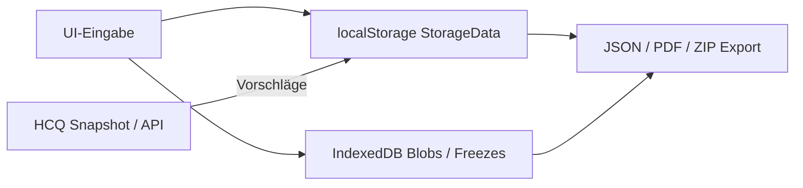

# Datenherkunft — Provenienz der Framework-Daten

**Produkt:** NIS2 Gap-Analyse-App + HCQ-K Engine  
**Stand:** 2026-08-20 · **Live:** https://nis2-kritis-web.onrender.com/  
**Zweck:** Nachvollziehbar machen, **woher** Bewertungen, Twins, Mappings und Nachweise stammen — ohne Overclaim.

> **Ehrlich:** Viele Felder sind **manuell** oder **Demo-kuratiert**. HCQ-K liefert **Vorschläge**, keine automatische Konformität. Autorität für den Status „erfüllt“ liegt immer beim Menschen mit Evidenz.

---

## 1. Übersicht der Datenquellen

| Quelle | Was kommt rein | Wo landet es | Autorität |
|--------|----------------|--------------|-----------|
| **Manuelle Eingabe (UI)** | Status, Kommentar, Verantwortlicher, Fragebogen, Governance | Browser `localStorage` / App-State | **Primär** für Gap-Status |
| **Rechtliche Texte / Katalog** | NIS2-/Art.21-/§38-Struktur, Leitfragen | Repo (`requirements.ts`, `art21Categories.ts`, Docs) | Kuratiert, kein Live-Gesetzesabruf |
| **Mapping-Registry** | Checklistenpunkt ↔ HCQ-Regel | `docs/mappings/nis2-readiness-mapping.yaml` + `frameworkMapping.ts` | Versioniert (v0.5.0) |
| **HCQ-K Readiness Snapshot** | Vorgeschlagene Status, Violations, Tickets | Import JSON oder REST-API | **Vorschlag** — Nutzer muss Übernehmen/Ignorieren |
| **HCQ-K Digital Twins** | Assets HW/SW/SBOM, Owner, Gate-Ampel | Twin-Baum `/gap/twins` | Engine-SSOT für Assets; Gap bleibt org-zentriert |
| **Policy-Container** | NIS2 / CRA / ISO-Regeln | HCQ-K `docs/policies/*.yaml` + Manifest/Schleuse | Versioniert, SHA-256 |
| **Demo-Seed** | Muster GmbH, kuratierte Twins/Fragebogen | Seed bei `VITE_DEMO_MODE` | Nur Demo — Kennzeichnung in UI |
| **Meldeautarkie / Freeze** | Zulieferer, Melde-Cache, Tages-Freeze | IndexedDB + Export | Lokal; Retention 3 Tage (Freeze) |
| **Exporte (ausgehend)** | Gap-JSON/PDF, Sorgfaltspaket ZIP, Snapshots | Download / USB | Abbild des lokalen Stands |

---

## 2. Speicherschichten (App)

| Schicht | Inhalt | Hinweis |
|---------|--------|---------|
| **localStorage** | Gap-Status, Fragebogen, Meta, Attestationen | Gerätegebunden; kein Cloud-Zwang |
| **IndexedDB** | Zertifikate, Übungsprotokolle, Freezes | Große Blobs; Teil des Sorgfaltspakets |
| **Session (Demo)** | Zugangscode / Demo-Token | Serverseitig geprüft, nicht im öffentlichen Build |

---

## 3. HCQ-K → App (eingehend)

| Kanal | Format | Typische Felder |
|-------|--------|-----------------|
| **Offline-Snapshot** | `readiness-snapshot.json` | `suggested_status`, `evidence_ref`, `open_violations`, Gate-Meta |
| **REST-API** | `GET` Readiness / Twins (Demo: Render-API) | Gleicher semantischer Stand wie Snapshot |

**Regel:** Snapshot/API **überschreibt** den Gap-Status nicht still. Übernehmen = bewusste Aktion.

Details: [`SCHNITTSTELLE-NIS2-HCQ-K.md`](./SCHNITTSTELLE-NIS2-HCQ-K.md)

---

## 4. Norm- und Katalogdaten (Repo)

| Artefakt | Herkunft |
|----------|----------|
| Checkliste A–E / F (AI Act) | Kuratiert aus NIS2 / AI Act; IDs in `app/src/data/requirements.ts` |
| Art. 21 lit. a–j | Mapping in `art21Categories.ts` (Spine) |
| § 38 BSIG Status Quo | Manuell gepflegter Wortlaut + Abdeckung (`bsigSection38.ts`, `legal/…`) |
| Policy-Regeln | YAML-Container in HCQ-K; kein Phone-Home |

**Kein** automatischer Abruf von EUR-Lex/Gesetze-im-Internet zur Laufzeit.

---

## 5. Demo vs. Produktiv

| | Demo (`VITE_DEMO_MODE`) | Produktiv / Lizenz |
|--|-------------------------|---------------------|
| Organisation | Muster GmbH (Seed) | Kundeneingabe |
| Twins / Mapping | Kuratiert, gekennzeichnet | Echte Syncs / Imports |
| Zugang | Zugangscode (serverseitig) | Lizenz / Activation |
| Aussagekraft | Schulung, Vertrieb, Test | Kundennachweis nur mit eigener Evidenz |

---

## 6. Was wir bewusst nicht als „Quelle“ verkaufen

- Keine Live-Anbindung an BSI-Portal / CSIRT
- Keine automatische Zertifizierungsdatenbank
- Keine stillen Cloud-Syncs der Gap-Bewertung
- OSCAL-Export / OPA: **Architektur-Zielbild** (siehe Handbuch §2.1) — Provenienz-Regel gilt analog: Evidence aus Twin/Gap, nicht aus Zertifikatsteller

---

## 7. Pflege

Bei neuen Datenpfaden:

1. Diese Datei um eine Zeile in §1 ergänzen  
2. Handbuch / Betriebsanleitung verlinken  
3. Bei Mapping: `nis2-readiness-mapping.yaml` + Tests (`e2e-hcq-snapshot`, Snapshot-Pytest)

**Verwandte Docs:**  
[`COMPLIANCE-HANDBUCH.md`](./COMPLIANCE-HANDBUCH.md) · [`BETRIEBSANLEITUNG.md`](./BETRIEBSANLEITUNG.md) · [`SCHNITTSTELLE-NIS2-HCQ-K.md`](./SCHNITTSTELLE-NIS2-HCQ-K.md) · [`MELDEAUTARK-ZULIEFERER.md`](./MELDEAUTARK-ZULIEFERER.md)
